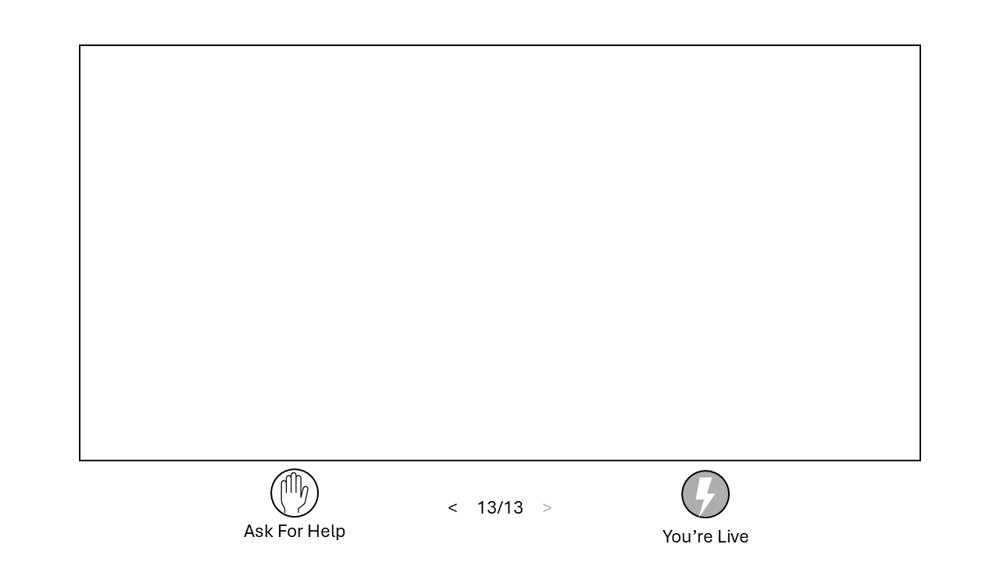
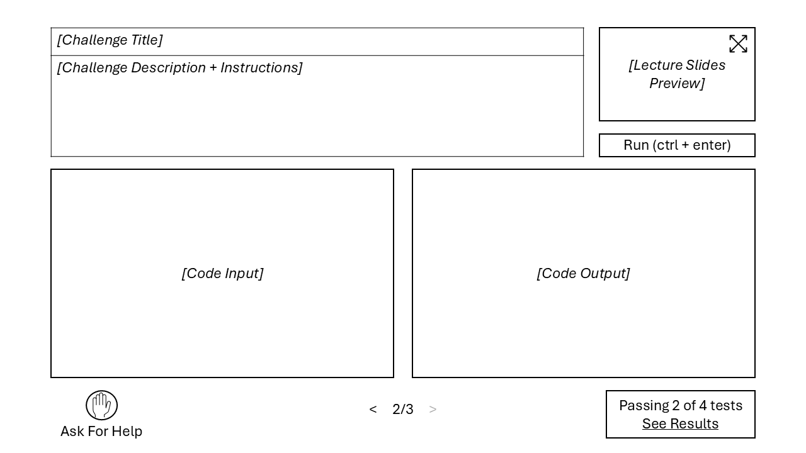

# System Design

***Note:*** This document represents current thinking and is expected to change.

## Student Interface - Draft 0

### 1. User Stories (student perspective)
#### Lecture Mode
- As a student, I want my screen to mirror the screen to mirror the teacher's so I can get a close look at the materials.
- As a student, I want to navigate backward through slides so I can review if I fall behind.
- As a student, I want to return to the current slide after review so I can rejoin the lecture.

#### Challenge Mode
- As a student, I want to see instructions while I work on a challenge.
- As a student, I want to retain access to lecture materials during challenges for any needed reminders.
- As a student, I want to write code and see results side-by-side.
- As a student, I want to decide when to move to the next challenge so I don't feel rushed.
- As a student, I want to request help so the teacher knows I'm stuck and where.

### 2. Functional Requirements
- The system must display the current slide synchronized with the teacher.
- The system must allow backward navigation through the slides.
- The system must allow the student to rejoin the live slide.
- The system must present challenge instructions and a coding environment.
- The system must allow access to lecture materials during challenges.
- The system must allow the student to request help from the teacher during a challenge.

### 3. UI Concepts
- The student interface operates in two modes: lecture and challenge.
- Lecture mode prioritizes slide visibility with minimal controls and distractions.
- Challenge mode presents code instructions, code input, and output simultaneously.
- A persistent control area provides status, lecture material reference, and access to help.

### 4. UI Sketches
#### Lecture Mode
[Student Lecture View](./sketches/student-lecture-view.png)

#### Challenge Mode
[Student Challenge View](./sketches/student-challenge-view.png)

